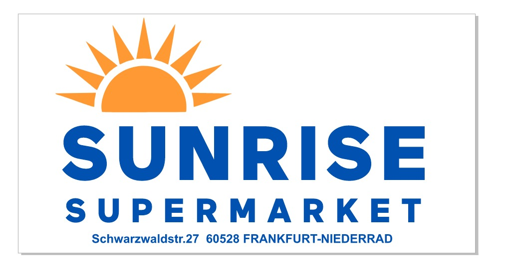

# srKasse API

Multi-tenant FastAPI backend for **Sunrise Supermarket** (srKasse). Single-DB tenancy via `tenant_id`, JWT auth, async SQLAlchemy, PostgreSQL.



## Stack

- FastAPI, async SQLAlchemy, PostgreSQL (asyncpg)
- JWT auth with `tenant_id` in token payload
- Alembic migrations

## Setup

```bash
python -m venv .venv
.venv\Scripts\activate   # Windows
pip install -e .
cp .env.example .env     # edit .env with your DB URL and secret
alembic upgrade head
uvicorn app.main:app --reload
```

- API: http://127.0.0.1:8000  
- Docs: http://127.0.0.1:8000/docs  
- Logo/branding: http://127.0.0.1:8000/static/logo.png  

## Tenancy

- Each user belongs to one tenant (`tenant_id` in JWT).
- Optional `X-Tenant-Id` header must match token; otherwise 403.
- Data (e.g. products) is scoped by `tenant_id`.

## License

Proprietary – Sunrise Supermarket.
